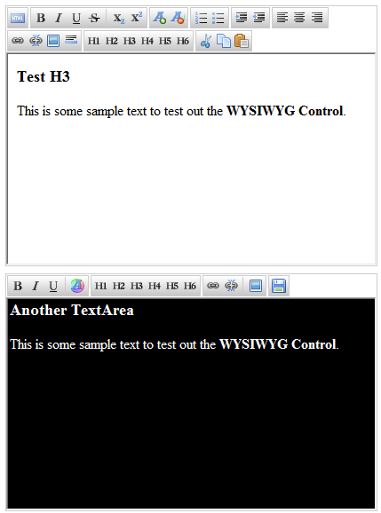

# jHtmlArea

A simple, light weight, extensible WYSIWYG HTML Editor built on top of jQuery. This component allows you to easily display a WYSIWYG HTML Editor in place of any TextArea DOM Elements on the page. The minified script alone is 9.17kb; CSS and Images it's a total of 25.9kb.

This project also includes Visual Studio JavaScript Intellisense support.

[View Documentation Here](https://github.com/crpietschmann/jHtmlArea/wiki)

## Key Advantages of jHtmlArea

- Free, open source (MIT License)

- Simple and Lightweight - 11kb minified - 25.3kb w/ css and images

- Supports all mainstream browsers - IE7+, Firefox 3+, Safari 4+, Chrome

- Built on top of jQuery (requires jQuery 1.3.2 or higher)

- Full Documentation

## NuGet Package

[http://nuget.org/packages/jHtmlArea](http://nuget.org/packages/jHtmlArea)


## Screenshots



## Basic Usage

```
$(function(){
    $("textarea").htmlarea();
});
```

## Tutorials / Articles

[jHtmlArea - The all NEW HTML WYSIWYG Editor for jQuery](http://pietschsoft.com/post/2009/07/21/jHtmlArea-The-all-NEW-HTML-WYSIWYG-Editor-for-jQuery.aspx)

[Adding Custom Toolbar Buttons](http://pietschsoft.com/post/2009/08/18/jHtmlArea-Adding-Custom-Toolbar-Buttons.aspx)

## Icons

This project also includes icons from the Silk Icon Set by Mark James. You can download the Silk Icon Set here:

[http://www.famfamfam.com/lab/icons/silk/](http://www.famfamfam.com/lab/icons/silk/)
